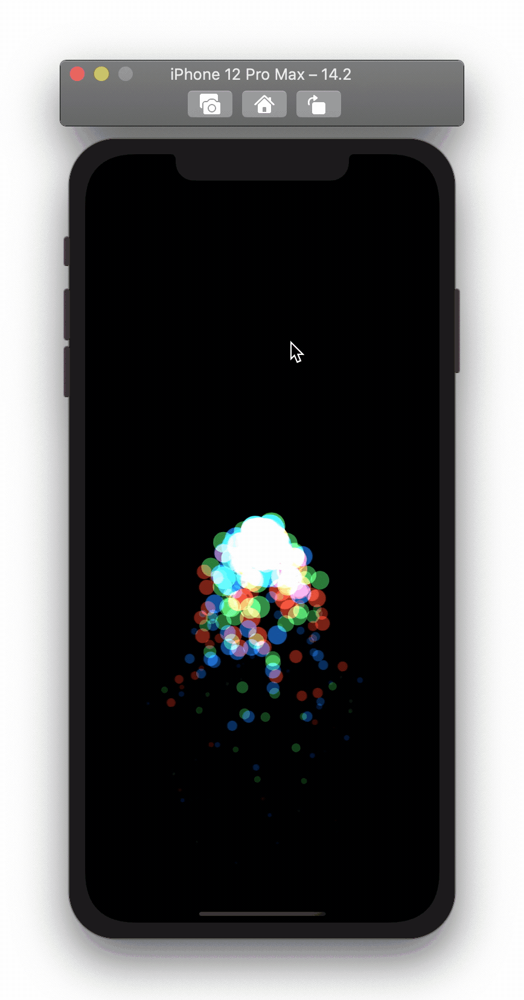

 <b>SwiftUI-DesignCode is some examples in the process of learning swiftUI. </b>

### Design
| **TactileSlider** | **ApplePhotosIcon** |  **NotificationBanner** |
| :------------: | :------------: | :------------: |
|  |  |  |

| **LoadingAnimations** | **SpringIndicator** | **GestureHandle** |
| :------------: | :------------: | :------------: |
| |  |  |

| **AppleRemote** | **CircleProgressBar** | **Clock** |
| :------------: | :------------: | :------------: |
| |  ||

| **ScalingOnScrollView** | **StretchHeadView** | **SlideOutMenu** |
| :------------: | :------------: | :------------: |
|  |  |  |

| **ParticleAnimationEffect** | **TwitterLauncherAnimation** | **SlideToLockState** |
| :------------: | :------------: | :------------: |
|  |  |   |

|**ActivityRingAnimation** | **LockScreenBatteryMagSafe**| **AppLock** |
| :------------: | :------------: | :------------: |
|  |  |  | 

| **Countdown** | **VoiceRecordingAnimation** | **Settings** |
| :------------: | :------------: | :------------: |
|  |  |   |

### Author
|   |  [DevLiuSir](https://github.com/DevLiuSir)  Software Engineer  [][1] [][2] [][3]|
| :------------: | :------------: |

[1]: https://twitter.com/LiuChuan_
[2]: https://github.com/DevLiuSir
[3]: https://devliusir.com/
